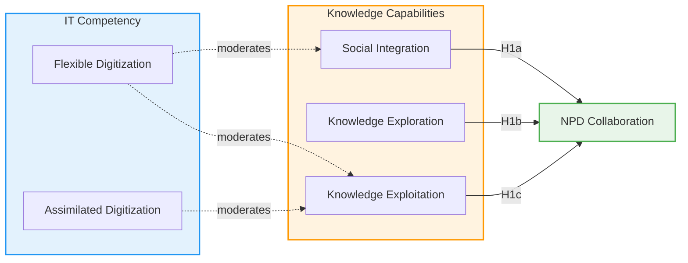

好的，這是根據你自訂的 **/p2o（Paper → Obsidian）** 模板，為論文〈**Synergy Unleashed: A Holistic Approach to Knowledge and IT in New Product Development**〉所生成的結構化導讀大綱。

---

## 🧩 Paper-to-Outline (p2o)

### 一、研究基本資訊

* **標題**：Synergy Unleashed: A Holistic Approach to Knowledge and IT in New Product Development
* **中文譯題**：〈釋放協同效應：新產品開發中知識與資訊科技的整合式研究〉
* **作者**：Xi Li, Adeel Luqman, Pasquale Sasso, Varun Chotia, Vikram Kumar Sharma
* **期刊**：*Journal of Knowledge Management*, 2025年
* **理論核心**：Resource Orchestration Theory (ROT)

---

### 二、研究動機與問題意識

* 既有研究多將 **Knowledge Capabilities** 與 **IT Competency** 分開探討，忽視兩者協同效應。
* 本研究回應此缺口，探討 IT Competency（Flexible / Assimilated Digitization）如何強化 Knowledge Capabilities（Social Integration, Exploration, Exploitation）對 NPD Collaboration 的影響。
* 核心問題：

  > 「不同類型的 IT Competency 是否能調節企業知識能力對新產品開發協作的影響？」

---

### 三、理論架構

* **理論基礎**：Resource Orchestration Theory (Sirmon et al., 2011)

  * 主張競爭優勢來自「資源的編排」（orchestration），非單一資源的持有。
  * 三階段：Acquisition → Deployment → Leveraging。
* **主要構念**：

  * *Knowledge Capabilities* → 社會整合、知識探索、知識運用
  * *IT Competency* → 彈性數位化、整合數位化
  * *Dependent Variable* → NPD Collaboration
* **假設（摘要）**：

  * H1：知識能力對NPD協作具正向影響。
  * H2a–c：Flexible Digitization 正向調節上述關係。
  * H3a–c：Assimilated Digitization 正向調節上述關係。

---

### 四、研究方法

* **樣本**：中國105家企業（n=327），涵蓋製造、電子與金融業。
* **設計**：時間間隔問卷法（manager–employee pair design）。
* **分析工具**：SPSS PROCESS Macro（Hayes, Model 2）。
* **信效度**：CFA通過；Cronbach’s α介於0.87–0.92。

---

### 五、主要發現

* 知識能力對NPD協作具有顯著正向影響（γ=0.28, p<.001）。
* IT Competency 單獨效果不顯著。
* 彈性數位化（Flexible Digitization）對社會整合與知識運用具顯著調節效果。
* 整合數位化（Assimilated Digitization）僅對知識運用具正向調節。
* 知識探索在兩種IT能力下皆不顯著。

→ 結論：**IT本身非直接推動力，而是「知識能力的放大器」。**

---

### 六、理論與實務貢獻

* **理論面**：

  * 提出「Knowledge–IT Synergy Model」，延伸 ROT 理論應用於創新協作領域。
  * 挑戰「科技即創新」假設，強調知識與社會互動為創新真正驅動力。
* **實務面**：

  * 技術基礎應與知識共享文化並行。
  * 彈性數位化結合社交整合最能促進跨界協作。
  * 單靠IT投資無法提升創新成效，必須同時編排「人、知識、科技」。

---

### 七、限制與未來研究方向

* 樣本侷限中國企業，建議跨文化比較。
* 橫斷式設計限制動態觀察。
* 可延伸至 AI 協作、虛擬團隊、永續創新情境。

---

### 八、Mermaid 理論模型可視化

---

### 九、結論一句話

> 「科技本身不創新，唯有與知識協奏，方能釋放協同效應。」

---

是否要我再根據這份 `/p2o` 大綱，自動生成一版適合放入簡報或課堂導讀投影片的格式（含圖表版面設計與段落摘要）？
